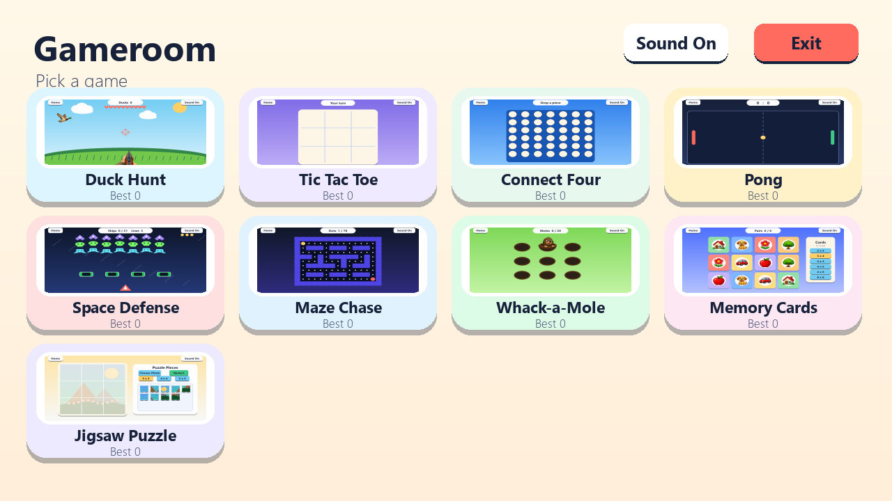

# Games for Grandpa

An accessible, mouse-only collection of original desktop games written in Python.

The project is also a sequential learning portfolio for object-oriented programming,
data structures, algorithms, testing, packaging, and release automation.



## Included games

- **Duck Hunt:** aim the shotgun, keep hitting ducks, and protect ten hearts as ducks get faster.
- **Tic Tac Toe:** play against medium minimax AI.
- **Connect Four:** drop pieces into a column against depth-limited AI.
- **Pong:** move one paddle with the mouse against easy speed-limited AI.
- **Space Defense:** move horizontally while automatic shots clear varied ships, shields block fire, and enemy bolts add pressure.
- **Maze Chase:** click a neighboring path or destination and collect the dots.
- **Whack-a-Mole:** hit the visible mole with a mallet and watch for dizzy feedback.
- **Memory Cards:** match colorful object cards and choose grids up to 6 x 6 from the side panel.
- **Jigsaw Puzzle:** drag shuffled pieces from the tray onto the picture board, with an optional photo picker.

Artwork is original, using code-drawn UI plus generated transparent sprites. The app does
not use copied Google Images or commercial game assets. This project is not affiliated with
or endorsed by any commercial game publisher.

## Run from source

Install Python 3.12 and `uv`, then run:

```powershell
uv sync
uv run games-for-grandpa
```

No keyboard input is required during play.

## Learn from the project

Start with [`docs/BUILD_GUIDE.md`](docs/BUILD_GUIDE.md), then use the annotated
`lesson-*` Git tags to rebuild each layer sequentially. Algorithm explanations live in
[`docs/DSA_GUIDE.md`](docs/DSA_GUIDE.md).

## Verify

```powershell
uv run ruff check .
uv run pytest
uv run games-for-grandpa --smoke-test
```

## Windows release

Download the portable ZIP from GitHub Releases, extract it, and open
`GamesForGrandpa.exe`. The first release is unsigned, so Windows SmartScreen may ask you to
confirm that you want to run it.

Release maintainers should follow [`docs/RELEASE.md`](docs/RELEASE.md).
The full acceptance checklist is in [`docs/TESTING.md`](docs/TESTING.md).
